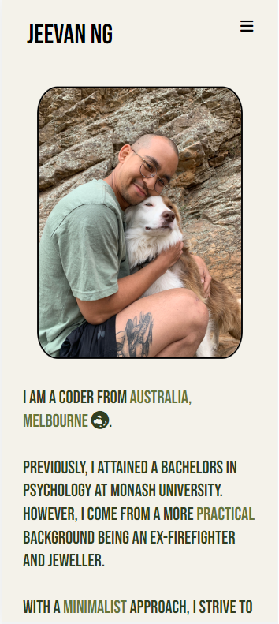
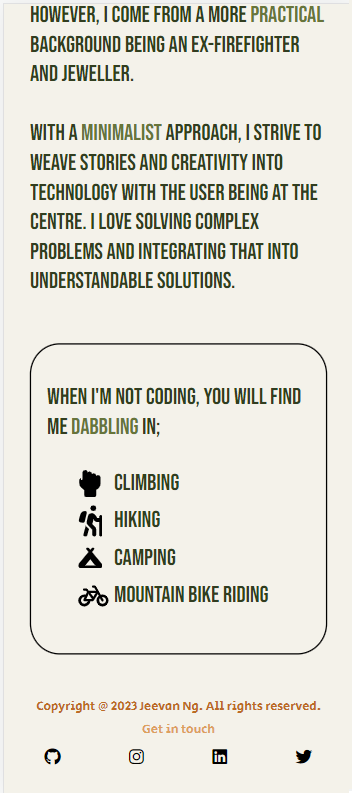
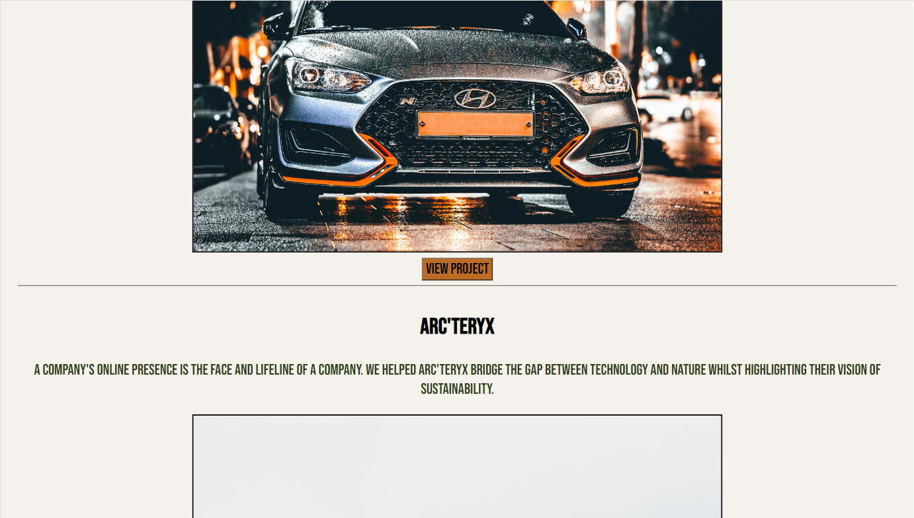

# JEEVAN NG - PORTFOLIO

Student number - 14373 

# LINK (URL) TO PORTFOLIO
https://jeevan-ng.netlify.app

# LINK TO GITHUB REPO
https://github.com/jeevanng/Portfolio.git

# LINK TO SLIDE PRESENTATION 
https://youtu.be/Bx6FpO7vig0

# DESCRIPTION 

## Purpose
- To create an online portfolio to digitally represent any work I have created, as well as my skills and experiences. 
- To give a first impression to future employers and show why I am unique. 
- Create my digital narrative in a positive way and showing what I am most proud of. 

## Functionality/Features
The website contains a multitude of functions/features that are responsive across different devices/widths. 

- Header
     - Header includes multiple functions across different devices to create a more seamless and integrated experience. 
     - On screens smaller than 768px (tablet), the nav bar turns into a hamburger icon, which when clicked will show the other pages in the html. Reduces clutter and reflects my minimalism approach.

- Footer
    - Includes links to all other professional platforms that I own. These links are images to reduce clutter and enhance design. 

- Home Page
    - Being the first thing a user will see, I wanted this to have impact and creative function/features to instantly showcase who I am. I decided to go with a cascading triangle that contains a photo I took of Mt. Fitzroy in Argentina, which I took in 2022. 
    - Each image is a link to a different page of the portfolio. I kept the hamburger menu for smaller screens for accessibility. 
    - The triangle will act as a navigation menu, where the user can click on an image to navigate the site. 
    - On active/click the nav bar will have a different background/font color to show that the user has clicked the link. 

        - Mobile
            - Being a smaller screen width, I enlarged the top triangle and ensured it took up 100vh, so it would always take up the whole vertical screen.
            - I animated the tip to rotate and point downwards, almost saying to scroll down. I wanted an extremely minimal and clean look with no distractions for mobile. 

        - Tablet 
            - The whole mountain is in display here whilst showing some of the text contained in the page. The hamburger menu is still active here to reduce clutter and direct the focus of the user to the main part. 

        - Desktop
            - Remove the nav bar in the header and no hamburger icon. Zoom in on images when mouse is hovering over. 
            - I ensured that the triangle would take up the whole vh, so the text would be pushed down. I wanted any desktop user to basically see a very clean home page, with nothing but my name and cascading triangle in view. 

- General 
    - The website contains clickable images and buttons to create a cleaner and more user friendly experience. 
    - I approached the design with a minimalism approach to de-clutter and only show the elements that are necessary to get my vision across. 
    - Links should open in a new page, so that users are never closing my website unless they do so on the actual html, thus increasing screen time. 
    - Fonts/sizing has been made responsive to ensure accessibility and readability across all devices. 
    - When a pointer is in use on any device, some images will zoom in on hover. This will help the user feel more connected to the website and feel like it's interactive and 3D, rather than being a 2D flat experience. 
    - The contact page contains a form with boxes to enter text to submit a message. 
    - Blog page allows me to share updates, news, insights that are important within the industry to visitors. 
    - All the multimedia used are to enhance the users experience, make the website more engaging and increasing screen time. 

# Sitemap

# Color Map

These are the colors that I have chosen to base my website off. It is a reflection of the adventurous, nature and outgoing side of me whilst also maintaining simplicity and coherency between the colors. 

# Screenshots

# Mobile (< 480px)
## Home page

## About

## Work

## Blog

## Contact

# Tablet (< 768px)
## Home page

## About

## Work

## Blog

## Contact

# Desktop (> 768px)
## Home page

~

## About

## Work

## Blog

## Contact

# Target Audience
This online portfolio was designed for future employers to get an insight into my skills, hobbies and interest.

These employers could be people from small businesses, large tech companies, individuals looking for freelancers etc.

This means that I have tried to highlight my skills and show what makes my stand out. I have aimed to make the portfolio accessible for a range of diverse groups. 

# Tech stack

- HTML
- CSS
- Sass 
- Javascript 
- Github
- Netlify for deployment
- Figma for wireframes
- Miro for sitemap 
