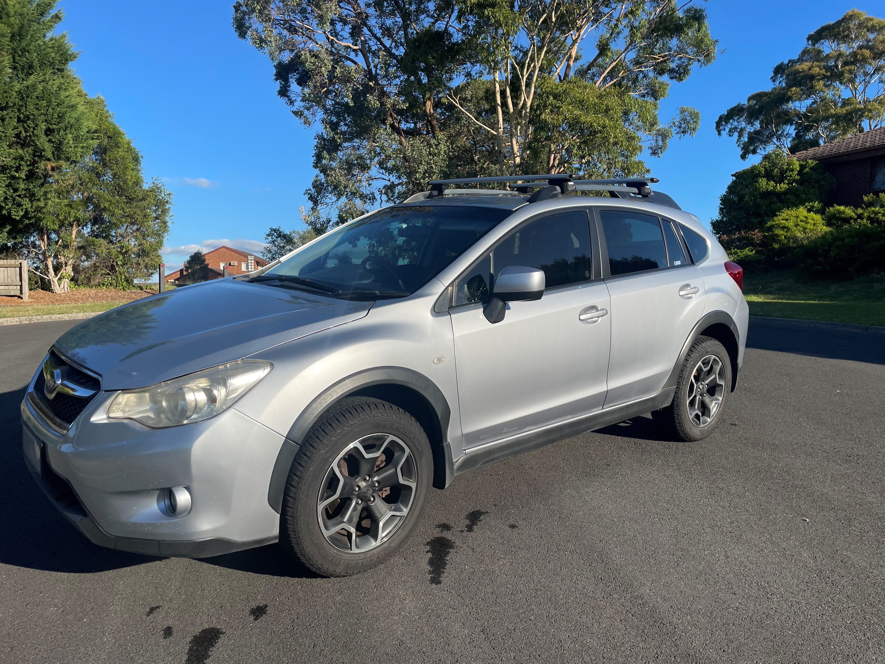

# Jeevan Ng - Portfolio 

# Overview 

This is a portfolio website for displaying personal information and work to the public. This is in development phase and we will keep adding those features in this readme that we add on the website. 

# Component 

## Header
Header has "Name" of the portfolio along with navigation bar. Here is the code we have for the header; 

```html
<header>
    <nav class="topnav" id="myTopnav">
        <a href="./index.html" class="active">JEEVAN NG</a>
        <a href="./pages/about.html">ABOUT</a>
        <a href="./pages/work.html">WORK</a>
        <a href="./pages/blog.html">BLOG</a>
        <a href="./pages/Contact.html">CONTACT</a>
        <a href="javascript:void(0);" class="icon" onclick="myFunction()">
            <i class="fa fa-bars"></i>
        </a>
    </nav>
</header>
```
## Footer
Added footer which contains some text and logo's. The logos are links that will open a new tab to the site directed by html. 

```html
<footer>
    <div class="info">
        <p class="copyright">Copyright @ 2023 Jeevan Ng. All rights reserved.</p>
        <p class="info2">Get in touch</p>
    </div>
    <!-- Links open new tab to have user stay on Portfolio page -->
    <div class="social-media">
        <a href="https://www.github.com" target="_blank">
            <i class="fa-brands fa-github"></i>
        </a>
        <a href="https://www.instagram.com" target="_blank">
            <i class="fa-brands fa-instagram"></i>
        </a>
        <a href="https://www.linkedin.com" target="_blank">
            <i class="fa-brands fa-linkedin"></i>
        </a>
        <a href="https://www.twitter.com" target="_blank">
            <i class="fa-brands fa-twitter"></i>
        </a>
    </div>
</footer>
```
# Pages

## Home
Home page now displays a short little introduction about me. Here is the text we have used;
```html
<p> Hello! I'm Jeevan, a web developer, an innovator, a minimalist and a dreamer who is 
    passionate about bridging the gap between reality and technology.
</p>
<p>I enjoy giving the "abstract" meaningful connection and emotions.</p>
```

Added the main body of the home page, a cascading triangle shaped mountain with an image in each container. Each photo is a link to another part of the page as well. Code below;

```html
<div class="mountain">
    <div class="triangle">
        <div class="inner_triangle"></div>
    </div>
    <a class="triangle2" href="./pages/about.html">
        <div class="inner_triangle2">
            
        </div>
    </a>
    <a class="triangle3" href="./pages/work.html">
        <div class="inner_triangle3">
            
        </div>
    </a>
    <a class="triangle4" href="./pages/blog.html">
        <div class="inner_triangle4">
            
        </div>
    </a>
    <a class="triangle5" href="./pages/contact.html">
        <div class="inner_triangle5">
            
        </div>
    </a>
</div>
```

## About

Added a photo container and the main text. Here is the code we used;

```html
<main>
    <article>
        <section>
            </img>
        </section>
        <section>
            <div class="abouttext">
                <p>
                I am a coder from Australia, Melbourne. Previously, I attained a Bachelors in Psychology at Monash University. 
                However, I come from a more practical background being an ex-firefighter and jeweller. With a minimalist 
                approach, I strive to weave stories and creativity into technology with the user being at the centre. 
                I love solving complex problems and integrating that into understandable solutions. 
                </p>
            </div>
        </section>
    </article>  
    <article>

    </article>
        <section>
            <div class="abouttext">
                 <p>
                    When I'm not coding, you will find me dabbling in
                    <ul>
                        <li>Climbing</li>
                        <li>Hiking</li>
                        <li>Camping</li>
                        <li>Mountain Bike Riding</li>
                    </ul>
                </p>
            </div>
        </section>
    </article>
</main>
```

## Work

Added the layout for the page. Contains text and then two sample work images below. Here is the code used;

```html
<main>
    <article>
        <section>
            <p>
            My main expertise lies in Web Development, particularly;
                <ul>
                    <li>
                        <i class="fa-brands fa-html5"></i>
                        HTML
                    </li>
                    <li>
                        <i class="fa-brands fa-css3-alt"></i>
                        CSS
                    </li>
                    <li>
                        <i class="fa-brands fa-square-js"></i>
                        Javascript
                    </li>
                </ul>
            </p>
            <p>
            However, I do dabble in UX/UI design, illustration and market research. 
            </p>
            <p>
            If you like my site, don't hesitate to reach out!
            </p>
        </section>
        
        <!-- Add a button for a link to my resume -->
        <section class="resume">
            <a href="../documents/resume.pdf" target="_blank">
                <button type="button">Resume</button>
            </a>
        </section>

        <section>
            <div class="workphotos">
                </img>
                </img>
            </div>
        </section>
    </article>  
</main>
```
## Blog

Added the blog page to contain five blog posts. Each with title and image. The code is below, repeated 5 times;

```html
    <article>
        <section>
            <a href="">
                <div class="blogtitle">
                    Blog Post 1 
                </div>
                </img>
            </a>
        </section>
    </article>
```
### Blog Posts
Added 5 seperate pages/posts under the blog page. All with buttons that will redirect back to the previous page. 

## Contact
Added a contact page with form and input fields. Allows the user to enter information to send a message. Code below;

```html
<main>
    <h2>CONTACT</h2>
    <form>
        <div class="form-elements">
            <label>Name:</label>
            <input class="form-input">
        </div>

        <div class="form-elements">
            <label>Email:</label>
            <input class="form-input">
        </div>

        <div class="form-elements">
            <label>Subject:</label>
            <input class="form-input">
        </div>

        <div class="form-elements">
            <label>Message:</label>
            <textarea rows="5" class="form-input form-textarea"></textarea>
        </div>

        <div class="btn-div">
            <button id="submit">SEND</button>
        </div>
    </form>
</main>
```

# Styling 

## Components
This will contain the styling of individual components which are as following at the moment; 
- Header 
- Footer

## Defaults
This will contain the default variables such as colors, breakpoints etc. 

# Documents
Contains a pdf file which is my resume. Link will be added via a button on the "work page"

# Javascript
The "responsive" class is added to the topnav with JavaScript when the user clicks on the icon. This class makes the topnav look good on small screens (display the links vertically instead of horizontally)

```html
<script>
    function myFunction() {
        var x = document.getElementById("myTopnav");
        if (x.className === "topnav") {
        x.className += " responsive";
        } else {
        x.className = "topnav";
        }
    }
</script>
```